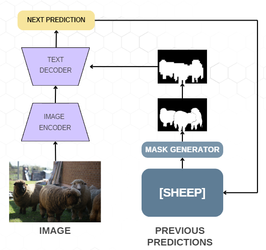
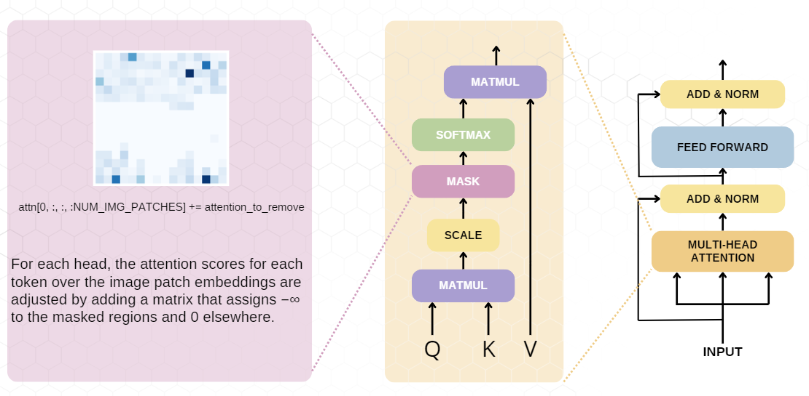

# AdvancedCV

# Improvement of Object Recognition as Next Token Prediction

Starting from the NXTP work we have tried to develop an improvement for that specific task. 
We have implemented a mask generator in order to focus the attention of the decoder on different part of the image.



In order to do this we generate a mask using Lang-SAM and then use this mask inside the attention layer of the decoder in order to guide the generation.




In order to have a better explanation of out work here there is our presentation:
[Presentation](https://www.canva.com/design/DAGYPQkzcbg/mvLZ-YAENbFt1j62KKdZNw/view?utm_content=DAGYPQkzcbg&utm_campaign=designshare&utm_medium=link2&utm_source=uniquelinks&utlId=h98ff271e9f)

## How to run it?

Create e conda environment:
```shell
conda env create -f environment.yml
conda activate nxtp_env
```

Follow the instruction in https://github.com/kaiyuyue/nxtp/tree/main?tab=readme-ov-file#models in order to download checkpoints of the model.

In order to run the normal nxtp code in infer:
```shell
python nxtp/src/infer.py \
    --ckpt-path CHECKPOINT_PATH \
    --img-path nxtp/assets/dog.jpg \
    --num-labels 10 \
    --save-attention-map True
```

In order to run our version of nxtp run:

```shell
python nxtp_ours/src/infer.py \
    --ckpt-path CHECKPOINT_PATH \
    --img-path nxtp/assets/dog.jpg \
    --num-labels 10 \
    --save-attention-map True
```

## Acknowledgements

This work is building on top of :

- [nxtp](https://github.com/kaiyuyue/nxtp)
- [lang-sam](https://github.com/luca-medeiros/lang-segment-anything)

